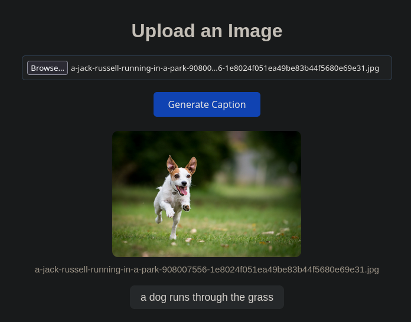

# FastImageCaptioning

A PyTorch-based image captioning application that generates descriptive captions for uploaded images using a hybrid attention-based model. Built with FastAPI for the backend and a clean web interface for easy image uploads.

## Screenshot



## Features

- 🖼️ **Web Interface**: Simple, user-friendly UI for uploading images and viewing generated captions
- 🤖 **Hybrid Attention Model**: Uses a CNN encoder (ResNet-50) with attention-based decoder for accurate image descriptions
- ⚡ **FastAPI Backend**: RESTful API for image caption generation
- 🐳 **Docker Support**: Containerized setup for easy deployment
- 📦 **PyTorch & Transformers**: Leverages state-of-the-art deep learning frameworks

## Architecture

### Model Components

- **CNN Encoder (CNNEncoderAttention)**: ResNet-50 backbone that extracts spatial feature maps from images
- **Attention-Based Decoder**: Generates captions word-by-word using attention mechanisms over image features
- **Hybrid Model**: Combines the encoder and decoder into a unified `HybridModelAttention` class

### Training Data

The pre-trained model included in this repository was trained on the **Flickr8k dataset**, which contains 8,000 images with 5 human-written captions per image. This dataset is widely used for evaluating image captioning models and ensures diverse, natural language descriptions.

### Tech Stack

- **Backend**: FastAPI, Python 3.13
- **ML Framework**: PyTorch, Transformers
- **Image Processing**: OpenCV, Pillow
- **Deployment**: Docker & Docker Compose
- **Frontend**: HTML, CSS, JavaScript (vanilla)

## Project Structure

```
ptorch/
├── src/
│   ├── fastapi/
│   │   └── app.py              # FastAPI application
│   └── imagecaptioning/
│       ├── model.py            # Model definitions
│       ├── inference.py        # Caption generation logic
│       ├── train.py            # Training script
│       ├── vocab.py            # Vocabulary utilities
│       └── token_utils.py      # Tokenization utilities
├── static/
│   └── index.html              # Web interface
├── Dockerfile                  # Container configuration
├── docker-compose.yml          # Docker Compose setup
├── pyproject.toml              # Python dependencies
├── model_weights.pt            # Pre-trained model weights
├── vocab.json                  # Vocabulary mappings
└── README.md                   # This file
```

## Installation

### Prerequisites

- Python 3.13+
- Docker & Docker Compose (optional)
- CUDA (optional, for GPU acceleration)

### Local Setup

1. Clone the repository:

```bash
git clone <repository-url>
cd ptorch
```

2. Install dependencies:

```bash
pip install -e .
```

3. Ensure you have the pre-trained model weights and vocabulary:

```bash
# model_weights.pt and vocab.json should be in the root directory
```

## Usage

### Running with Docker

1. Build and start the application:

```bash
docker compose up --build
```

2. Open your browser and navigate to:

```
http://localhost:8000/app
```

### Running Locally

1. Start the FastAPI server:

```bash
uvicorn src.fastapi.app:app --host 0.0.0.0 --port 8000 --reload
```

2. Open your browser and navigate to:

```
http://localhost:8000/app
```

### API Endpoints

#### POST `/upload`

Upload an image and generate a caption.

**Request**:

```bash
curl -X POST "http://localhost:8000/upload" \
  -F "file=@image.jpg"
```

**Response**:

```json
{
  "caption": "a dog sitting on a grass field"
}
```

#### GET `/docs`

Interactive API documentation (Swagger UI).

#### GET `/redoc`

Alternative API documentation (ReDoc).

## Web Interface

The web interface provides:

- **File Upload**: Browse and select images
- **Image Preview**: See your image before generating a caption
- **Caption Display**: View the generated caption
- **Responsive Design**: Works on desktop and mobile devices

## Dependencies

Key packages are listed in `pyproject.toml`:

- `fastapi>=0.129.0` - Web framework
- `torch>=2.10.0` - PyTorch
- `torchvision>=0.25.0` - Vision utilities
- `transformers>=5.1.0` - Pre-trained models
- `opencv-python>=4.13.0.92` - Image processing
- `uvicorn>=0.41.0` - ASGI server
- `python-multipart>=0.0.22` - File upload handling

## Configuration

### Model Settings

The model uses the following configuration (in `src/fastapi/app.py`):

- **Device**: CPU by default (change to CUDA in app.py for GPU support)
- **Model Type**: HybridModelAttention
- **Vocabulary**: Loaded from `vocab.json`

### Docker Environment Variables

```yaml
PYTHONUNBUFFERED=1
PYTHONDONTWRITEBYTECODE=1
```

## Performance

- **Inference Speed**: ~1-3 seconds per image (CPU)
- **Model Size**: ~100MB (ResNet-50 backbone + decoder weights)
- **Supported Image Formats**: JPG, PNG, GIF, BMP, TIFF

## Health Check

Docker health check monitors the application:

```bash
curl -f http://localhost:8000/docs
```

## Development

### Training a New Model

To train your own caption generation model:

```bash
python -m src.imagecaptioning.train --config your_config.yaml
```

**Note**: The current pre-trained model was trained on the **Flickr8k dataset**. To replicate or improve upon this model, you can fine-tune it on the same dataset or use your own custom image-caption pairs.

### Inference Script

For batch caption generation:

```bash
python -m src.imagecaptioning.inference --image_path /path/to/image.jpg
```

## Future Enhancements

- [ ] GPU acceleration support
- [ ] Batch image processing
- [ ] Multi-language caption support
- [ ] Fine-tuning capabilities
- [ ] Advanced image preprocessing
- [ ] Confidence scores for captions

## Troubleshooting

### Docker Build Failures

```bash
docker compose build --no-cache
```

### Model Not Loading

Ensure `model_weights.pt` and `vocab.json` are in the project root directory.

### CUDA Issues

The app defaults to CPU. To enable GPU, modify `device` in `src/fastapi/app.py`:

```python
device = torch.device("cuda" if torch.cuda.is_available() else "cpu")
```

## License

MIT

## Author

Arsalanjdev

## Contributing

Contributions are welcome! Please feel free to submit a Pull Request.

## Support

For issues, questions, or feature requests, please open an issue on GitHub.
